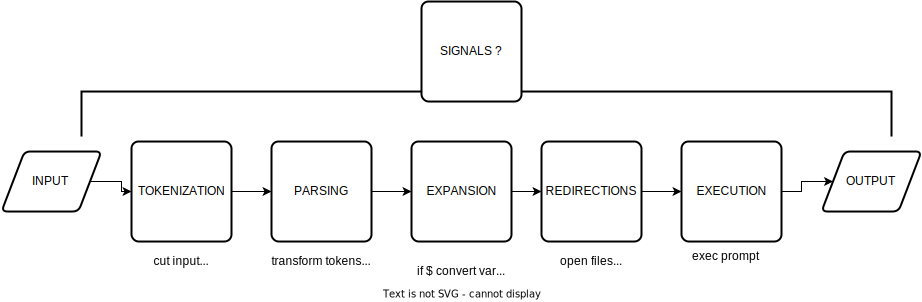
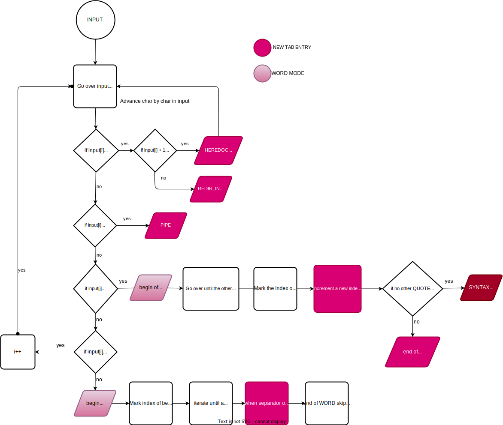
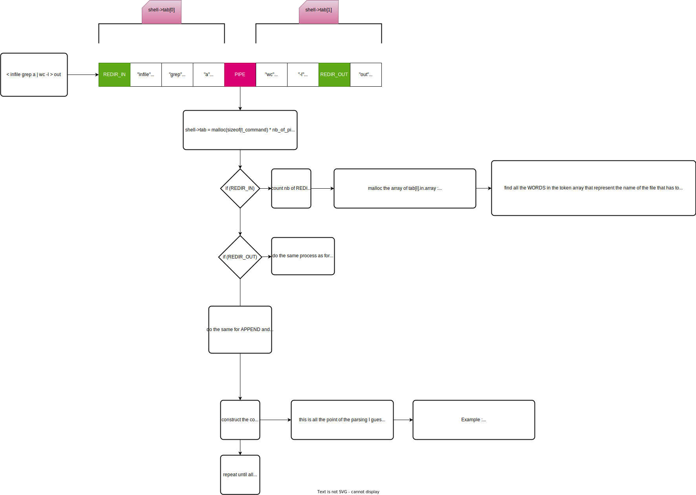
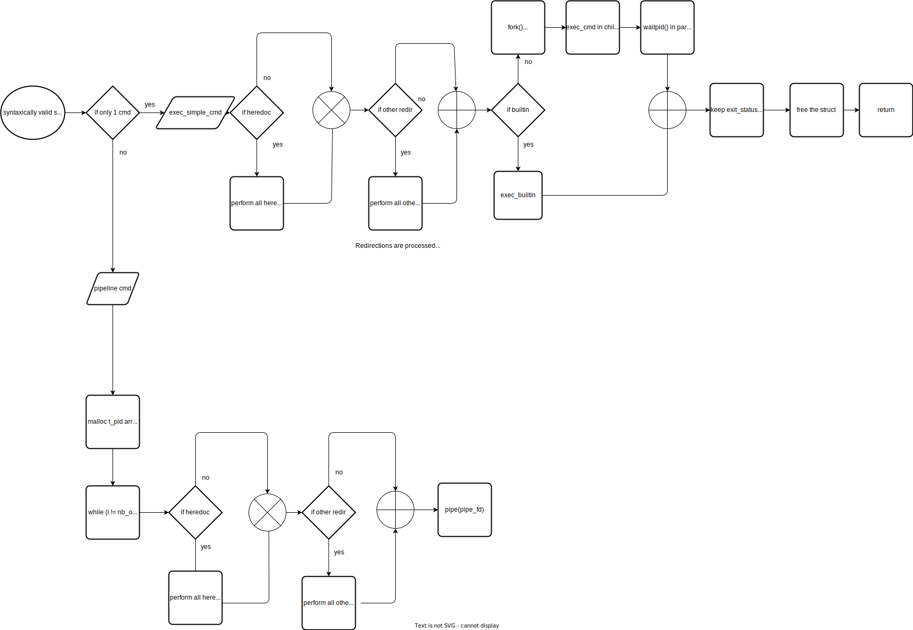

# Doc minishell

#### This is extracted from the Bash manual

The following is a brief description of the shell’s operation when it reads and executes a command. Basically, the shell does the following:
1. Reads its input.
2. Breaks the input into words and operators, obeying the quoting rules described in [Quoting](https://www.gnu.org/software/bash/manual/bash.html#Quoting). These tokens are separated by metacharacters.
3. Parses the tokens into simple and compound commands ([Shell Commands](https://www.gnu.org/software/bash/manual/bash.html#Shell-Commands)).
4. Performs the various shell expansions ([Shell Expansions](https://www.gnu.org/software/bash/manual/bash.html#Shell-Expansions)), breaking the expanded tokens into lists of filenames ([Filename Expansion](https://www.gnu.org/software/bash/manual/bash.html#Filename-Expansion)) and commands and arguments.
5. Performs any necessary redirections ([Redirections](https://www.gnu.org/software/bash/manual/bash.html#Redirections)) and removes the redirection operators and their operands from the argument list.
6. Executes the command ([Executing Commands](https://www.gnu.org/software/bash/manual/bash.html#Executing-Commands)).
7. Optionally waits for the command to complete and collects its exit status ([Exit Status](https://www.gnu.org/software/bash/manual/bash.html#Exit-Status)).

### Tokenization workflow (in progress)

### Parsing workflow (in progress)

### Execution workflow (in progress)

